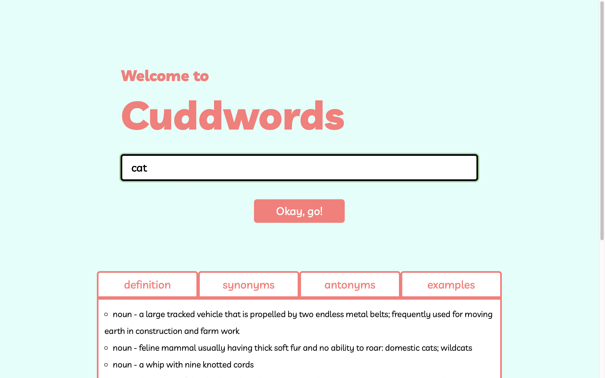
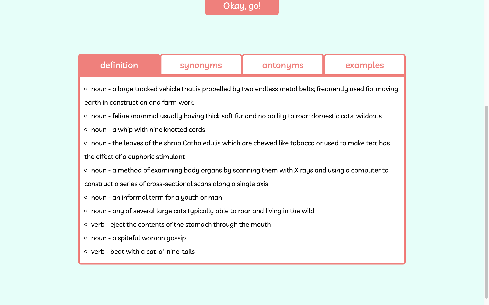
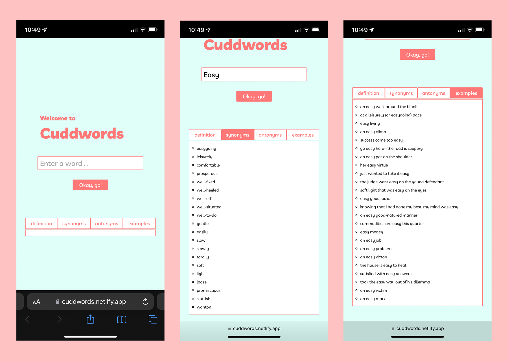

# Cuddwords Web Application

Cuddwords is a dictionary web application that provides some uncommon information, including some elementary word information.

A word's meaning can be misleading and unhelpful. Cuddwords can have their own specific information on definitions, synonyms, antonyms, and examples of clearly defined words.

### Tech stack 

    

### Demo

